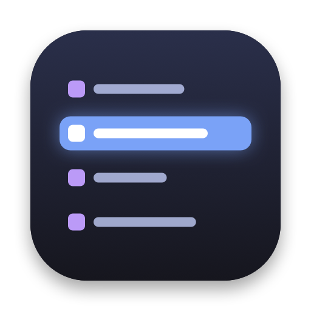
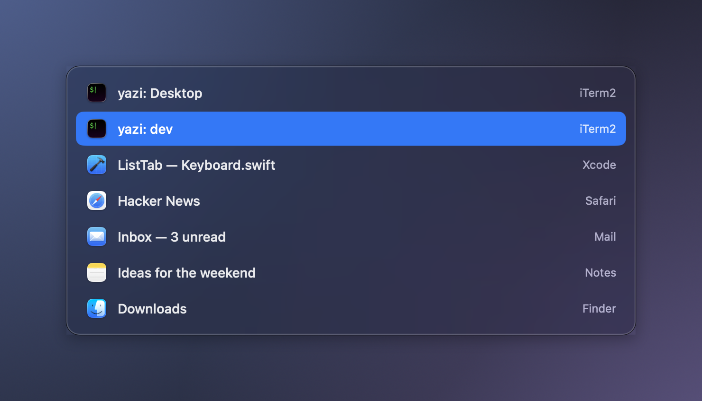
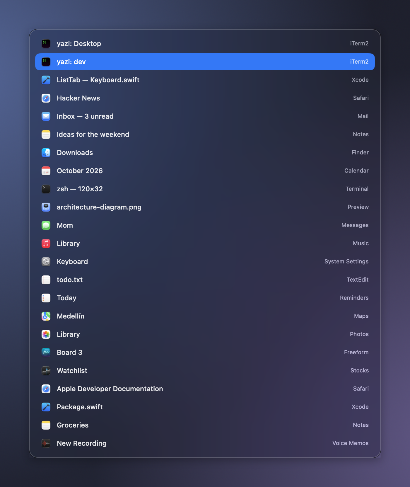

<p align="center"></p>

# ListTab

**⌘Tab, but a list of windows with their full titles. Free, native, ~550 lines of Swift.**

> I got tired of AltTab. In 2026, paying a premium for something Windows has shipped since forever —
> *switch between windows, and tell me which one is which* — felt ridiculous to me. So I made my own.

<p align="center"></p>

## Why

On macOS, ⌘Tab switches between **apps**, not windows. Open six terminals and you get one icon.
That is the problem Windows' Alt+Tab solved a long time ago, and the reason I installed [AltTab](https://alt-tab.app/).

AltTab is good, and its core is open source. But its *Titles* style — the compact list that lets you
read `yazi: Desktop` and `yazi: dev` instead of a grid of identical `yazi…` thumbnails — is part of **AltTab Pro**,
a paid tier. I only wanted the list. So I built exactly that: nothing more.

## What it does

- **⌘Tab / ⌘⇧Tab** opens a list of your windows: **icon · full title · app**, most recent first.
- **↑ ↓** to move, **release ⌘** or **Return** to jump, **Esc** to cancel.
- **No scrolling, ever** (almost). The rows shrink as needed so *every* window is visible. A list that hides
  3 of your 10 windows behind a scrollbar is lying to you.
- Includes minimized windows. Quick ⌘Tab taps switch instantly with no flicker (the panel appears after 100 ms).
- Menu bar icon with *Quit & restore ⌘Tab*. No Dock icon.

<p align="center"></p>
<p align="center"><sub>23 windows, all visible. The panel scales instead of scrolling.</sub></p>

## Install

**From a release** (universal binary: Apple Silicon + Intel, macOS 14+):

1. Download `ListTab-x.y.z.dmg` from [Releases](../../releases) and drag **ListTab** to *Applications*.
2. The app isn't notarized (that needs a paid Apple Developer account — see the theme here), so macOS will block it
   the first time. Run once in Terminal:
   ```bash
   xattr -dr com.apple.quarantine /Applications/ListTab.app
   ```
3. Open it and grant **Accessibility** in *System Settings → Privacy & Security → Accessibility*.
4. Quit AltTab or any other switcher (two apps can't own the same shortcut), then press **⌘Tab**.

**From source** (needs Xcode):

```bash
./build.sh install      # builds a universal app, signs it, copies it to ~/Applications
./package.sh            # builds dist/ListTab-x.y.z.dmg
```

> **Stable permissions.** With ad-hoc signing macOS forgets the Accessibility permission on every rebuild.
> `build.sh` signs with a local self-signed certificate named `ListTab Local Signing` if it finds one in your
> keychain; the one-time recipe to create it is in [`docs/signing.md`](docs/signing.md).

## Privacy

- Needs **Accessibility** only. No Screen Recording, no Input Monitoring.
- No network code, no telemetry, no analytics. Read the source: it's eight small files.

## ⚠️ It disables the native ⌘Tab

To receive ⌘Tab, ListTab turns off macOS's own shortcut (the same way AltTab does) and turns it back on when it quits.
That setting **survives a crash**. If the app is force-killed and ⌘Tab stops working:

```bash
/Applications/ListTab.app/Contents/MacOS/ListTab --restore-native
```

## Limitations (v0.1)

- Lists windows of the **current Space** (plus minimized ones). Other Spaces need private SkyLight APIs; not done yet.
- It relies on two private macOS functions (`_AXUIElementGetWindow`, `CGSSetSymbolicHotKeyEnabled`).
  They have been stable for years, but Apple can break them in any release.
- Tested on macOS 26 (Tahoe), Apple Silicon only. Intel and macOS 14–15 are untested.
- No mouse, search, close/quit from the list, or launch-at-login yet.

## How it works

| Piece | File | Technique |
|---|---|---|
| ⌘Tab / ⌘⇧Tab | `Keyboard.swift` | Carbon hotkey + native shortcut disabled; passive tap for ⌘ release; active HID tap only while open |
| Window list & order | `Windows.swift` | Accessibility API for titles; `CGWindowList` z-order for recency |
| State machine | `Switcher.swift` | begin / step / commit / cancel, 100 ms delayed panel |
| UI | `PanelView.swift` | `NSPanel` + SwiftUI list; row height adapts so everything fits |
| Private API shims | `PrivateAPI.swift` | two `@_silgen_name` declarations |

## Developing

```bash
ListTab --list                       # print the windows the switcher would show
ListTab --show                       # open the panel for 6 s without installing shortcuts
ListTab --show --demo --count=23     # fake windows on a neutral backdrop (used for these screenshots)
tools/screenshots.sh                 # regenerate images/
swift tools/make-icon.swift          # regenerate the app icon
```

## Credits

The architecture (Carbon hotkey + passive/active event taps + disabling the native shortcut) comes from reading
the source of [AltTab](https://github.com/lwouis/alt-tab-macos), which is GPL-3.0. I wrote this code from scratch;
the two private-function declarations are the same public signatures AltTab uses. Thanks to its author —
the point of this project is only that one list view shouldn't need a license key.
