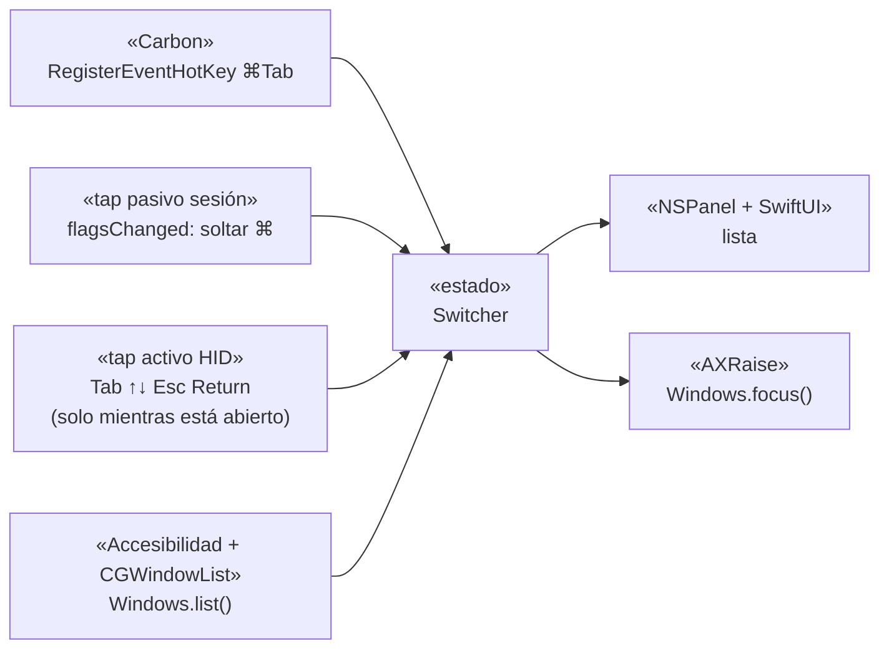

# ListTab

Cambiador de ventanas para macOS: **⌘Tab con lista** (icono · título completo · app), como AltTab pero sin pagar el estilo "Titles".
Swift nativo, sin dependencias. Versión 0.1 (mínima).

## Uso

| Tecla | Acción |
|---|---|
| `⌘Tab` / `⌘⇧Tab` | abre la lista / recorre hacia delante / hacia atrás |
| `↓` `↑` | mover la selección |
| soltar `⌘` o `Return` | ir a la ventana |
| `Esc` | cancelar |

Alcance de la v0.1: ventanas del **Space actual** y minimizadas, ordenadas por recencia (z-order). No lista ventanas de otros Spaces.

## Instalar

```bash
./build.sh install      # compila, firma ad-hoc, copia a ~/Applications/ListTab.app
```

1. Salir de AltTab (dos apps no pueden tener el mismo atajo).
2. Abrir `ListTab` y conceder **Accesibilidad** (Ajustes del Sistema → Privacidad y seguridad). La app reintenta sola cada segundo.
3. `⌘Tab`.

## Firma estable (el permiso de Accesibilidad sobrevive a recompilar)

Con firma ad-hoc el permiso se pierde en cada build (macOS lo ata al hash del binario). `build.sh` firma con el certificado local **"ListTab Local Signing"** si existe en el llavero; así el requisito de firma queda atado al certificado y no al binario. En un Mac nuevo hay que crearlo una vez:

```bash
cat > cs.cnf <<'CNF'
[req]
distinguished_name=dn
x509_extensions=ext
prompt=no
[dn]
CN=ListTab Local Signing
[ext]
basicConstraints=critical,CA:false
keyUsage=critical,digitalSignature
extendedKeyUsage=critical,codeSigning
CNF
openssl req -x509 -newkey rsa:2048 -nodes -keyout k.pem -out c.pem -days 3650 -config cs.cnf
openssl pkcs12 -export -inkey k.pem -in c.pem -out c.p12 -passout pass:listtab
security import c.p12 -k ~/Library/Keychains/login.keychain-db -P listtab -T /usr/bin/codesign
rm k.pem c.p12 cs.cnf        # c.pem puede quedarse; el certificado vence en 10 años
```

Si tras migrar de firma ad-hoc a esta aparece ListTab duplicada en Accesibilidad: quitar la entrada vieja con `−` y volver a añadir.

## Seguridad: el ⌘Tab nativo

Para recibir `⌘Tab` hay que apagar el atajo del Dock (`CGSSetSymbolicHotKeyEnabled` 1 y 2). **Ese apagado persiste aunque la app muera.**
La app lo restaura al salir (menú → *Salir y restaurar ⌘Tab*, SIGTERM/SIGINT/SIGHUP). Si se cierra a la fuerza (`kill -9`, crash) y pierdes el ⌘Tab nativo:

```bash
~/Applications/ListTab.app/Contents/MacOS/ListTab --restore-native
```

## Pruebas sin teclado

```bash
ListTab --list     # imprime las ventanas que vería el switcher
ListTab --show     # abre el panel 6 s para ver el diseño (no instala atajos)
```

## Arquitectura (calcada de AltTab, lwouis/alt-tab-macos, GPL-3)



Archivos: `Keyboard.swift` (atajos y taps), `Switcher.swift` (estado), `Windows.swift` (enumerar/enfocar), `PanelView.swift` (UI), `PrivateAPI.swift` (`_AXUIElementGetWindow`, `CGSSetSymbolicHotKeyEnabled`).

## Pendiente (versión completa)

- Ventanas de otros Spaces (requiere APIs privadas de SkyLight).
- Arranque al iniciar sesión (LaunchAgent).
- Firma estable para no re-conceder Accesibilidad en cada build.
- Cerrar/ocultar ventana desde la lista, ratón, búsqueda.
