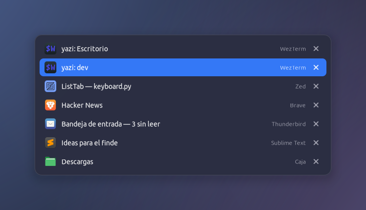
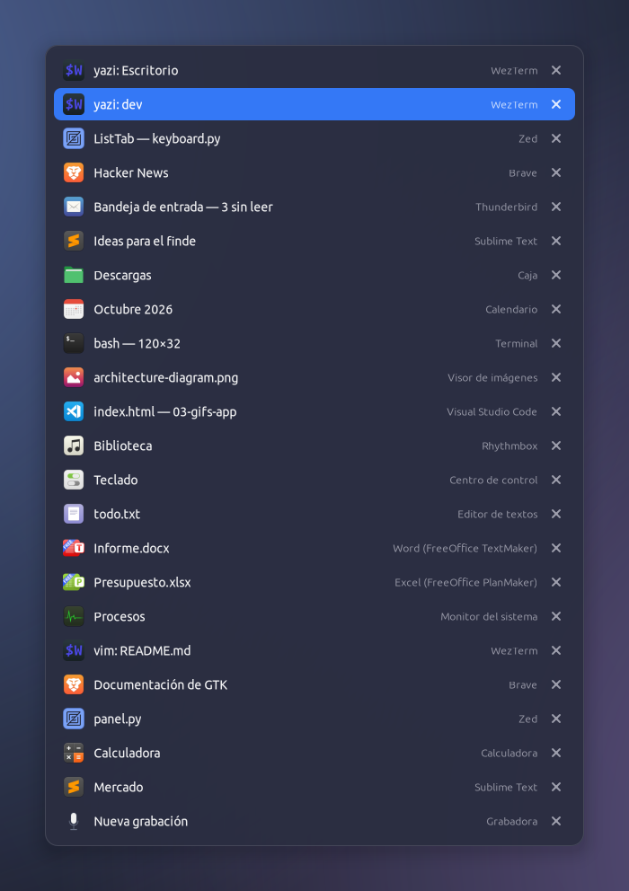

<p align="center"></p>

# ListTab for Linux

**Alt+Tab, but a list of windows with their full titles. For MATE on X11. ~1,200 lines of Python, no build step.**

A port of [ListTab for macOS](https://github.com/andysierra/Listtab) — same UI, same behavior — to the
Linux desktop I actually use (Linux Mint MATE).

<p align="center"></p>

## Why

MATE's Alt+Tab shows a row of icons and the title of *one* window at a time. Open six terminals or six
browser windows and you are guessing. I wanted the same list I built for macOS: read `yazi: Escritorio`
and `yazi: dev`, pick one, done.

## What it does

- **Alt+Tab / Alt+Shift+Tab** opens a list of your windows: **icon · full title · app**, most recent first.
- Recency is tracked **per window**, not per app: Alt+Tab toggles between your last two *windows* even if
  two of them belong to the same app (WezTerm A → Brave → WezTerm A, never dragging WezTerm B in between).
- **↑ ↓** to move, **release Alt** or **Return** to jump, **Esc** to cancel.
- **Close from the list.** Each row ends with a **✕**: click it to close that window (same as the title-bar ✕).
  **Shift-click** — or press **Q** — quits the whole app; **W** closes the selected window from the keyboard.
  The row disappears at once and the list re-reads reality a moment later, so a window that asks to save
  its changes simply stays (the app shows its usual prompt).
  *(On macOS this is ⌥-click; on Linux Alt is the key you are holding, so it became Shift.)*
- **No scrolling, ever** (almost). The rows shrink as needed so *every* window is visible.
- **All workspaces or just this one** (tray menu, or `listtab --workspaces=all|current`). Default: windows of
  *every* workspace; those on another one say so (`Brave · escritorio 2`) and jumping there switches workspace.
- Includes minimized windows. Quick Alt+Tab taps switch instantly with no flicker (the panel appears after 100 ms).
- Tray icon with *Open at login*, the workspace setting and *Quit & restore Alt+Tab*.
  Settings live in `~/.config/listtab/settings.json`.

<p align="center"></p>
<p align="center"><sub>23 windows, all visible. The panel scales instead of scrolling.</sub></p>

## Install

Linux Mint MATE (22.x) already ships everything it needs: Python 3, GTK 3, libwnck, python3-xlib,
AyatanaAppIndicator. No `sudo`, no compiling.

```bash
./install.sh              # copies to ~/.local/share/listtab, adds `listtab` and a menu entry
listtab                   # run it (or "ListTab" from the menu / rofi)
listtab --login-on        # start at login (also in the tray menu)
./install.sh uninstall
```

Elsewhere you need: an X11 session, `gir1.2-gtk-3.0 gir1.2-wnck-3.0 python3-gi python3-xlib python3-cairo`,
and a compositor for the rounded, translucent panel (MATE's Marco has one, on by default in Mint).

## ⚠️ It disables MATE's own Alt+Tab

Only one program can own Alt+Tab. ListTab sets Marco's *switch windows* shortcuts to `disabled` and puts them
back when it quits (the originals are saved in `~/.config/listtab/native.json`). That setting **survives a crash**.
If ListTab is force-killed and Alt+Tab stops working:

```bash
listtab --restore-native
```

## Limitations (v0.1)

- **X11 only.** Wayland doesn't let a regular app grab Alt+Tab or read other apps' windows.
- Tested on Linux Mint 22.3 MATE (Marco + compositor), one monitor.
- No search or mouse-hover selection yet; rows can't be clicked to jump (use the keyboard).

## How it works

| Piece | File | Technique |
|---|---|---|
| Alt+Tab / Alt+Shift+Tab | `keyboard.py` | `XGrabKey` on the root window (Marco's binding disabled first); `XGrabKeyboard` only while open; Alt release + 40 ms watchdog |
| Window list & order | `windows.py` | libwnck (what MATE's panel uses) for titles, state, close/activate; app name & icon from the matching `.desktop` |
| Per-window recency | `recency.py` | `_NET_ACTIVE_WINDOW` changes, recorded once focus *settles* (150 ms) |
| State machine | `switcher.py` | begin / step / commit / cancel, 100 ms delayed panel |
| UI | `panel.py` | override-redirect GTK window drawn with cairo + Pango; row height adapts so everything fits |
| Native shortcut | `native.py` | Marco's `switch-windows*` keys via GSettings, restored on exit / SIGTERM |

### macOS → Linux

| macOS | Linux (MATE / X11) |
|---|---|
| Carbon hotkey + `CGSSetSymbolicHotKeyEnabled` | `XGrabKey` + Marco keys in GSettings |
| HID event tap while open | `XGrabKeyboard` while open |
| Accessibility API (`AXUIElement`) | libwnck |
| `AXObserver` focus notifications | `_NET_ACTIVE_WINDOW` via Wnck |
| `NSPanel` + SwiftUI | GTK popup + cairo/Pango |
| Menu bar item, `SMAppService` | AppIndicator tray icon, `~/.config/autostart` |
| ⌥-click ✕ = quit app | Shift-click ✕ = quit app |

## Developing

Create `~/.listtab-debug` to log every decision to `~/.cache/listtab.log`. Run from the repo with `bin/listtab`.

```bash
listtab --login-on / --login-off     # start at login without the tray menu
listtab --workspaces=all|current     # windows of every workspace (default) or only the current one
listtab --selftest                   # per-window MRU scenario with real windows (2 of one app + 1 of another)
listtab --selftest-close             # really closes 2 xed windows with ListTab's own code
listtab --list                       # print the windows the switcher would show
listtab --track[=N]                  # follow focus N seconds, then print the MRU order
listtab --show                       # open the panel for 6 s without installing shortcuts
listtab --show --demo --count=23     # fake windows on a neutral backdrop (used for these screenshots)
tools/screenshots.sh                 # regenerate images/
```

## Credits

Port of [ListTab for macOS](https://github.com/andysierra/Listtab), whose architecture comes from reading
[AltTab](https://github.com/lwouis/alt-tab-macos). Written from scratch for X11.

## License

[MIT](LICENSE).
